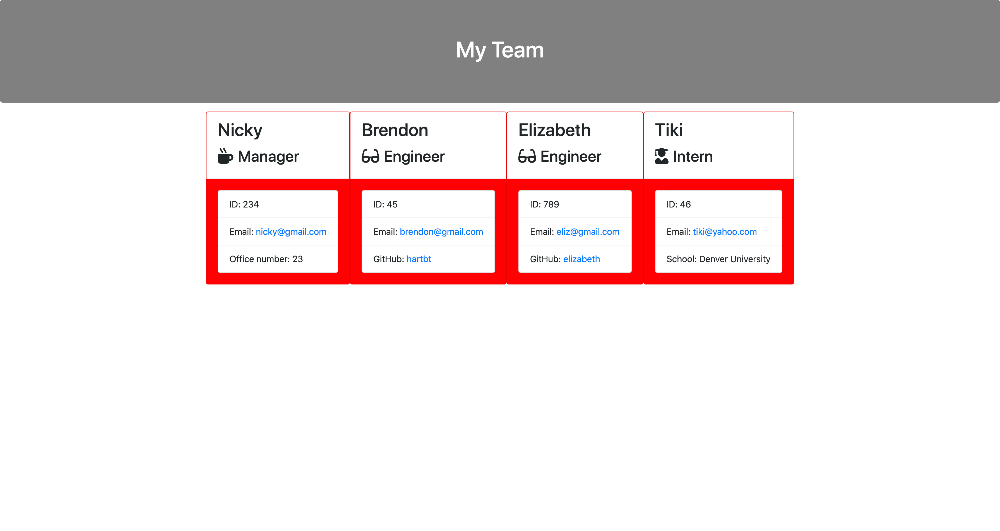

# **Description**

This assignment serves as a workplace team generator using node.js. After the user runs the command "node app.js" they are prompted with an intial question of which role thy would like to add; they are also able to select that they do not want to add a role, which will then create all of the html elements using the implemented javascript. If the user chooses to add a role, they are then prompted with questions that are suited to that particular role, and those answers are then stored into an html document, ready to be called upon. 

<iframe src="https://drive.google.com/file/d/1OY4tyeewx-SRrccFhKkzfhr_OUKk6Qbf/preview" width="640" height="480"></iframe>

<strong>Link to site:</strong> https://hartbt.github.io/hw-8-templateEngine/

<strong>Screenshot of site:</strong> 

# **Installation**

Run the following commands: 

* nmp init
* npm install inquirer

# **Usage**

When the code is pulled down and then opened within the terminal, the user can run the command "node app.js". User will then be prompted with whether or not that want to add more roles; if so, they will be asked which roles they would like to add. After selecting a role, the user will be prompted with questions specific that role. When the user selects that they would not like to add anymore roles, the html is generated. 

# **Technologies Used**

This application takes advantage of markdown language, Javascript, as well as NODE.js.

All three technologies are used in tandem in order to take information received using node, translate it into html, and then use javascript to populate a page. 

# **Problems Faced**

This assignment was fairly easy to complete with the help of my classmates. 

# **Credits**

Though this website was created by me, it was only done so using knowledge provided by many of my classmates as well as my tutor. 

# **License**

N/A